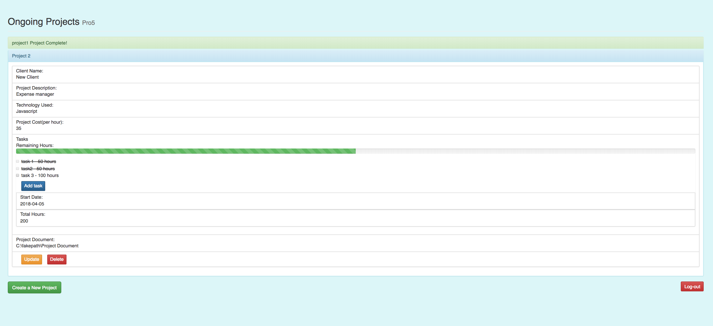

# Project Management Tool

**Live**:https://project-management-tool.netlify.com/

 

### About the App
A Project Management Tool.
Project manager signs-up new or logs-in into existing account to create new projects.
Once the project is created, he can manage the projects (Add new, Update existing, Delete) the projects.
Individual project status can be checked. New tasks can be added,updated or deleted.

### Features

- Sign-up or Log-in to use the app
- Create new projects
- Manage existing projects
- Manage tasks for each project

### Technology Used

### Front-end
- React.js, Redux, Redux Thunk, JWT authentication, HTML, CSS3, React-Bootstrap

### Back-end
- Node.js, Express.js, Passport.js, REST APIs, MongoDB, Mongoose
